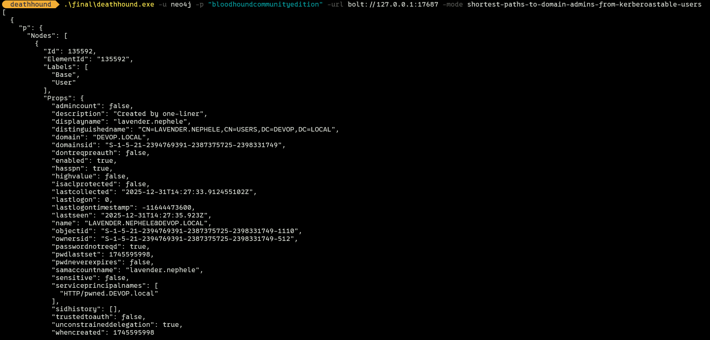

# DeathHound



**DeathHound** is a headless, cross-platform Command Line Interface (CLI) for executing BloodHound queries against a Neo4j database. It allows operators to run attack primitives, audit queries, and custom Cypher queries directly from the terminal without needing the BloodHound GUI.

Designed for efficiency and automation, DeathHound outputs strictly formatted JSON, making it ideal for piping into other tools (like `jq`) or integrating into larger offensive pipelines.

## Features

- **Headless Execution:** Run BloodHound queries without the Electron app.
- **Cross-Platform:** Works on Windows, Linux, and macOS.
- **Strict JSON Output:** easy integration with other tools.
- **Extensive Query Library:** Includes **189+** pre-defined queries from the SpecterOps BloodHound Query Library.
- **Categorized Modes:** list and execute queries by category (e.g., Kerberoasting, ASREPRoasting, Domain Admin paths).
- **Custom Query Support:** Run raw Cypher queries from files or stdin.
- **Secure:** Supports custom database credentials and connection URLs.

## Usage

```powershell
DeathHound - Headless BloodHound CLI

Usage:
  deathhound [options]

Options:
  -u string
        Neo4j User (default "neo4j")
  -p string
        Neo4j Password (default "bloodhoundcommunityedition")
  -url string
        Neo4j Bolt URI (default "bolt://localhost:7687")
  -mode string
        Execution mode (e.g., 'kerberoast')
  -file string
        Path to file containing Cypher query

Examples:
  List all available queries:
    deathhound -mode list

  Run a specific attack primitive:
    deathhound -mode kerberoast
    deathhound -mode shortest-path

  Run from file (bypasses shell escaping issues):
    deathhound -file my_query.cypher

  Connect to a specific Neo4j instance:
    deathhound -u neo4j -p Secret -url bolt://192.168.1.10:7687 -mode domain-admins
```

## Examples

### 1. List Available Queries
View all pre-defined queries grouped by category:
```bash
./deathhound -mode list
```

### 2. Find Kerberoastable Users
Execute the built-in Kerberoasting query:
```bash
./deathhound -mode kerberoast
```

### 3. Custom Connection & File Query
Connect to a remote instance with custom credentials and run a query file:
```bash
./deathhound -u admin -p "SupersecretPassword123" -url bolt://127.0.0.1:17687 -file ./tempquery
```

## Installation

Download the latest binary from the [Releases](https://github.com/0xSterny/deathhound/releases) page.

### Building from Source

Requirements:
- Go 1.20+

```bash
git clone https://github.com/0xSterny/deathhound.git
cd deathhound
go build
```

## Tools

### Query Generator
The project includes a `gen.exe` tool in `tools/` that allows you to regenerate the internal query library from YAML files.

```bash
# Build the generator
go build -o tools/gen.exe tools/gen_queries.go

# Add your custom YAML queries to a folder and regenerate
./tools/gen.exe -in ./my-custom-queries -out ./internal/library/library.go
```
